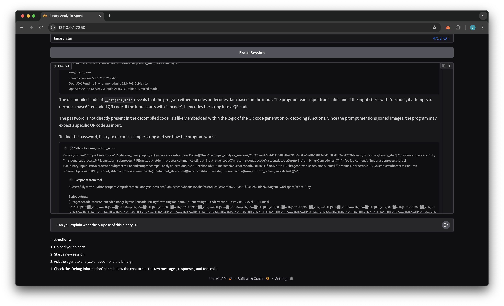

# DecompAI: Binary Analysis and Decompilation Agent

DecompAI is a Gradio-based LLM agent that automates binary analysis and decompilation workflows. Whether you’re a newcomer to reverse engineering or an experienced practitioner, DecompAI helps you explore, debug, and decompile x86 Linux binaries in a conversational interface.

---

## Table of Contents

- [DecompAI: Binary Analysis and Decompilation Agent](#decompai-binary-analysis-and-decompilation-agent)
  - [Table of Contents](#table-of-contents)
  - [Features](#features)
  - [Setup \& Configuration](#setup--configuration)
  - [Docker \& First-Run Build](#docker--first-run-build)
  - [Running the Application](#running-the-application)
  - [Usage Overview](#usage-overview)
    - [1. Upload a Binary](#1-upload-a-binary)
    - [2. Automatic Analysis](#2-automatic-analysis)
    - [3. Interactive Chat](#3-interactive-chat)
  - [Filesystem \& Sessions](#filesystem--sessions)
  - [Supported Binaries \& Future Plans](#supported-binaries--future-plans)
  - [Testing \& Benchmarks](#testing--benchmarks)
  - [Contributing](#contributing)
  - [Authors](#authors)
  - [Ethics \& Legal](#ethics--legal)

---

## Features

- **AI-Driven Decompilation**: Step-by-step decompilation assistance via a ReAct-style agent.
- **Binary Analysis**: List functions, disassemble sections, summarize assembly.
- **Tool Integration**: Leverage `objdump`, `gdb`, Ghidra (with custom AI hooks), and dozens of Kali-provided tools.
- **Interactive Chat**: Ask the agent questions, request specific tool runs, or direct decompilation actions.
- **Session Persistence**: Uploading the same binary restores your previous workspace.
- **Frameworks**: Built on LangGraph, LangChain and Gradio.

---

## Setup & Configuration

1. **Clone & Dependencies**

```bash
git clone https://github.com/louisgthier/decompai.git
cd decompai
pip install -r requirements.txt
```

2. **Environment Variables**  
   Create a `.env` file in the project root with your API keys and model choice:

```dotenv
OPENAI_API_KEY=sk-proj-ABC...
GEMINI_API_KEY=ya29.A0AR...
LLM_MODEL=gemini-2.0-flash      # or gemini-2.5-flash-preview-04-17
```

Other OpenAI or Gemini models work too, and providers using the OpenAI client can be used with minor code tweaks.

3. **Docker**  
   Ensure Docker is installed and running; DecompAI uses a privileged Kali-based container to expose many binary analysis tools.

---

## Docker & First-Run Build

- **Automatic Build Trigger**  
  On your first binary upload, the Docker image build will start automatically.
- **Long Build Time**  
  Building can take **15+ minutes**. We plan to publish prebuilt images to a container registry; contributions to automate this in CI/CD are welcome.
- **Privileged Container**  
  The container runs in privileged mode to allow low-level tool execution—please audit code and run in a secure environment.

---

## Running the Application

- **Standard**

```bash
python run.py
```

- **Hot Reload (Gradio CLI)**

```bash
gradio run.py
```

- **Access**  
  Open your browser to:

```bash
http://localhost:7860
```

---

## Usage Overview

### 1. Upload a Binary

Drag & drop or click to select your executable file. The agent will initialize a session based on the file’s hash to ensure persistent workspaces across uploads.

### 2. Automatic Analysis

Depending on the binary’s size, the agent will begin by disassembling or summarizing the file. Tool-specific setups and session environment are launched in the background.

### 3. Interactive Chat

Start a conversation with the agent to:

- Understand what the binary does.
- Decompile functions step by step.
- Explore potential vulnerabilities or attack surfaces.
- Request disassembly or function listings.
- Use integrated tools like `gdb`, `ghidra`, or `objdump` explicitly by asking the agent to do so.
- Combine stateful and stateless shell interactions to inspect the binary from different angles.

Whether you're a beginner curious about how compiled code works, or a reverse engineer accelerating your workflow, the agent is designed to adapt to your requests naturally.



---

## Filesystem & Sessions

- **Workspace Storage**  
  Sessions are stored under the path configured by `ANALYSIS_SESSIONS_ROOT` in `config.py`.
- **Session Keys**  
  Workspaces are keyed by the SHA-256 hash of the binary; re-uploading restores your previous work.
- **Persistence Warning**  
  Data in `/tmp` (or your custom `ANALYSIS_SESSIONS_ROOT`) is ephemeral and cleared on reboot.

---

## Supported Binaries & Future Plans

- **Current Support**:
- x86 Linux ELF binaries only.
- **Roadmap**:
- QEMU-backed multiplatform support (ARM, MIPS, Windows PE, etc.).
- UI-based workspace export/download.

---

## Testing & Benchmarks

Validated on CTF challenges (e.g., [Root-Me](https://www.root-me.org/)), consistently solving **3/5 difficulty** exercises in an automated or semi-automated fashion.

---

## Contributing

We welcome pull requests!

- **New Tools**: Add scripts or wrappers in `src/tools/`.
- **CI/CD**: Help automate Docker builds and registry publishing.
- **Bugfixes & Enhancements**: Fork, commit against `main`, and open a PR.

---

## Authors

- **Louis Gauthier** - [@louisgthier](https://github.com/louisgthier)
- **Clément Florval** - [@ClementFrvl](https://github.com/ClementFrvl)

---

## Ethics & Legal

> **Disclaimer:** DecompAI is intended **only** for lawful reverse engineering, educational use, and security research. The authors **do not** assume liability for misuse. Always comply with software licenses and local laws.
